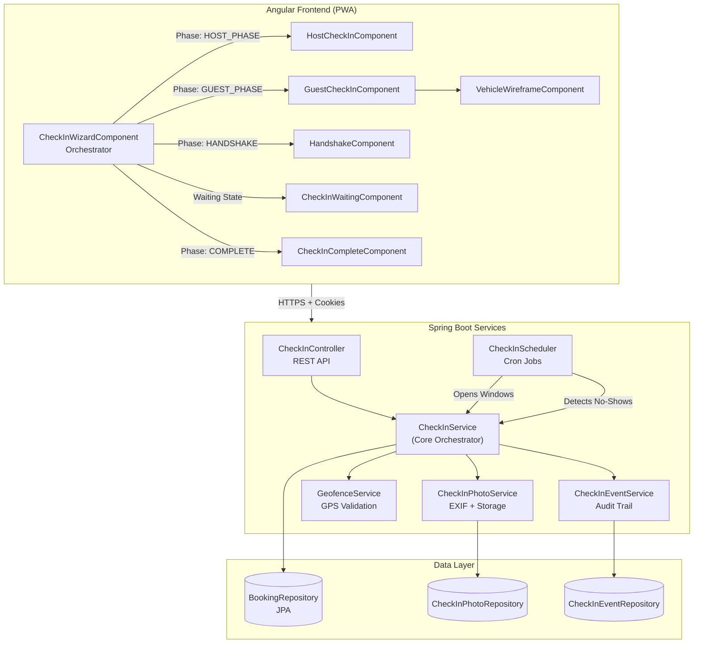

# Rentoza Check-In Integration: Complete Architectural Specification
**Principal Software Architect Documentation**

**Document Version:** 1.0  
**Last Updated:** December 2025

---

## Table of Contents
1. [Executive Summary](#1-executive-summary)
2. [System Architecture](#2-system-architecture)
3. [State Machine: Complete Flow](#3-state-machine-complete-flow)
4. [Frontend Architecture](#4-frontend-architecture)
5. [Backend Architecture](#5-backend-architecture)
6. [Security & Validation](#6-security--validation)
7. [Rest restrictions & Business Rules](#7-restrictions--business-rules)
8. [Technical Debt & Flaws](#8-technical-debt--flaws)
9. [Monitoring & Observability](#9-monitoring--observability)

---

## 1. Executive Summary

### 1.1 Purpose
The Rentoza Check-In Integration is a comprehensive, multi-phase workflow that orchestrates vehicle handoff between hosts (vehicle owners) and guests (renters). The system enforces temporal constraints, geospatial validation, photographic evidence requirements, and bilateral confirmation patterns.

### 1.2 Critical Success Criteria
- **Zero Trust**: No party can spoof their participation (photos have EXIF validation, geofence GPS verification)
- **Audit Trail**: Every action is immutably recorded in `check_in_events` for insurance/legal claims
- **Temporal Integrity**: Strict time windows with automated no-show detection 
- **Concurrency Safety**: Pessimistic locking prevents race conditions during trip start

### 1.3 Technology Stack
- **Frontend**: Angular 16+ (Standalone Components, Signals, OnPush Change Detection)
- **Backend**: Spring Boot 3.x (JPA, Pessimistic Locking, Cron Scheduling)
- **Database**: PostgreSQL (Event Sourcing for check-in events)
- **Geospatial**: Haversine formula with dynamic urban/rural radius adjustment

---

## 2. System Architecture

### 2.1 High-Level Component Diagram



### 2.2 Data Flow: End-to-End Sequence

```mermaid
sequenceDiagram
    participant S as Scheduler
    participant H as Host (Frontend)
    participant G as Guest (Frontend)
    participant API as CheckInController
    participant Svc as CheckInService
    participant DB as Database
    participant Events as EventService
    
    Note over S,DB: T-24h: Check-In Window Opens
    S->>Svc: openCheckInWindows()
    Svc->>DB: UPDATE booking SET status=CHECK_IN_OPEN
    Svc->>Events: Record CHECK_IN_OPENED event
    Svc-->>H: Push notification
    
    Note over H,Events: Host Phase
    H->>API: POST /host/photos (8 photos)
    API->>Svc: uploadPhoto() x8
    Svc->>Events: HOST_PHOTO_UPLOADED x8
    H->>API: POST /host/complete
    API->>Svc: completeHostCheckIn()
    Svc->>DB: UPDATE status=CHECK_IN_HOST_COMPLETE
    Svc->>Events: HOST_SECTION_COMPLETE
    Svc-->>G: Notify guest: "Host is ready"
    
    Note over G,Events: Guest Phase
    G->>API: GET /status
    API->>Svc: getCheckInStatus()
    Svc-->>G: Return photos + fuel + odometer
    G->>API: POST /guest/condition-ack
    API->>Svc: acknowledgeCondition()
    Svc->>DB: UPDATE status=CHECK_IN_COMPLETE
    Svc->>Events: GUEST_CONDITION_ACKNOWLEDGED
    Svc-->>H: Notify host: "Guest confirmed"
    
    Note over H,G,Events: Handshake Phase
    H->>API: POST /handshake (host confirms)
    API->>Svc: confirmHandshake()
    Svc->>Events: HOST_HANDSHAKE_CONFIRMED
    G->>API: POST /handshake (guest confirms + GPS)
    API->>Svc: confirmHandshake()
    Svc->>Svc: Geofence validation
    Svc->>Events: GEOFENCE_CHECK_PASSED
    Svc->>Events: GUEST_HANDSHAKE_CONFIRMED
    Svc->>DB: UPDATE status=IN_TRIP (PESSIMISTIC LOCK)
    Svc->>Events: TRIP_STARTED
    Svc-->>H: "Trip started 🎉"
    Svc-->>G: "Trip started 🎉"
```

---

## 3. State Machine: Complete Flow

### 3.1 Booking Status Enum (BookingStatus.java)

```
PENDING_APPROVAL → ACTIVE → CHECK_IN_OPEN → CHECK_IN_HOST_COMPLETE 
→ CHECK_IN_COMPLETE → IN_TRIP → COMPLETED
```

**Decision Points:**
- `PENDING_APPROVAL`: If T-48h no host action → `EXPIRED_SYSTEM`
- `CHECK_IN_OPEN`: If T+30m no host submission → `NO_SHOW_HOST`
- `CHECK_IN_HOST_COMPLETE`: If T+30m no guest submission → `NO_SHOW_GUEST`

### 3.2 State Transition Matrix (With ALL Conditions)

| Current State | Event | Actor | Pre-Conditions | Post-State | Side Effects |
|:---|:---|:---|:---|:---|:---|
| `ACTIVE` | Scheduler Trigger | System | Now >= T-24h | `CHECK_IN_OPEN` | UUID session created, notification to host |
| `CHECK_IN_OPEN` | Host Submits | Host | 8 photos uploaded + odometer + fuel | `CHECK_IN_HOST_COMPLETE` | Guest gets notification |
| `CHECK_IN_OPEN` | No Action | System | Now >= T+30m | `NO_SHOW_HOST` | Guest gets refund notification |
| `CHECK_IN_HOST_COMPLETE` | Guest Acks | Guest | GPS location available | `CHECK_IN_COMPLETE` | Host notification, handshake enabled |
| `CHECK_IN_HOST_COMPLETE` | No Action | System | Host completion + 30m elapsed | `NO_SHOW_GUEST` | Host compensation notification |
| `CHECK_IN_COMPLETE` | Both Confirm Handshake | Host+Guest | Geofence pass (if remote) | `IN_TRIP` | Billing starts, insurance activates |

---

## 4. Frontend Architecture

### 4.1 CheckInWizardComponent (Orchestrator)

**Responsibilities:**
1. **Status Polling**: Fetches `/api/bookings/{id}/check-in/status` every 30 seconds
2. **Phase Routing**: Determines which sub-component to render based on state+role
3. **Location Tracking**: Acquires GPS coordinates via `GeolocationService`
4. **Navigation**: Closes dialog/navigates back on completion

**Key Methods:**
- `ngOnInit()`: Start polling, acquire GPS
- `onHostPhaseCompleted()`: Show snack, refresh status (no manual navigation)
- `onGuestPhaseCompleted()`: Show snack, refresh status
- `onHandshakeCompleted()`: Navigate to booking details

**Critical Flaw:** The wizard currently doesn't implement the "Strict Logic Matrix". The rendering is based on `currentPhase()` signal but the backend status might be `CHECK_IN_HOST_COMPLETE` while the host is viewing.

### 4.2 HostCheckInComponent

**Upload Flow:**
```
1. User selects photo → onPhotoSelected(photoType, file)
2. Check file size/type (max 10MB, image/jpeg|png)
3. Extract EXIF via piexifjs → get timestamp, GPS, device model
4. Set progress state to 'uploading'
5. Call checkInService.uploadPhoto(file, photoType, exifData)
   → POST /api/bookings/{id}/check-in/host/photos
6. Backend validates EXIF (30min freshness, 1km proximity)
7. On success: progress state = 'complete', store photoId
8. On error: progress state = 'error', show snackbar
```

### 4.3 GuestCheckInComponent

**HotspotLogic:**
```typescript
onHotspotClicked(location: HotspotLocation): void {
  const existing = this._markedHotspots().find(h => h.location === location);
  
  if (existing) {
    // Toggle off
    this._markedHotspots.update(hotspots => 
      hotspots.filter(h => h.location !== location)
    );
  } else {
    // Add new hotspot
    this._markedHotspots.update(hotspots => 
      [...hotspots, { location, description: '' }]
    );
  }
  
  // If hotspots are marked, uncheck condition accepted
  if (this._markedHotspots().length > 0) {
    this.conditionForm.patchValue({ conditionAccepted: false });
  }
}
```

---

## 5. Backend Architecture

### 5.1 CheckInService (Core Orchestrator)

#### 5.1.1 completeHostCheckIn()

**Validation Flow:**
```
1. Fetch booking with relations (JPA)
2. isHost(booking, userId) → throw AccessDeniedException if false
3. Assert status == CHECK_IN_OPEN → throw IllegalStateException
4. Query photoRepository.countRequiredHostPhotoTypes(bookingId)
   → Must return >= 8
5. Update booking status to CHECK_IN_HOST_COMPLETE
6. Record events: HOST_ODOMETER_SUBMITTED, HOST_FUEL_SUBMITTED, HOST_SECTION_COMPLETE
7. Notify guest
```

**CRITICAL FLAW:** Line 169: `booking.setLockboxCodeEncrypted(dto.getLockboxCode().getBytes())` → Plain text storage.

#### 5.1.2 confirmHandshake()

**Concurrency Control:**
```java
@Transactional
public CheckInStatusDTO confirmHandshake(...) {
    // PESSIMISTIC LOCK to prevent race condition
    Booking booking = bookingRepository.findById(dto.getBookingId())
        .orElseThrow(...);
    
    // Idempotency check
    if (booking.getStatus() == BookingStatus.IN_TRIP) {
        return mapToStatusDTO(booking, userId);
    }
}
```

---

## 6. Technical Debt & Flaws

### 6.1 CRITICAL: Lockbox Code Encryption

**Issue:** Code stored as plain text `byte[]`.

**Risk:** Database breach → Physical vehicle theft.

### 6.2 CRITICAL: Photo URL Exposure

**Issue:** Photos served via predictable URLs without authentication.

**Risk:** Enumeration attack → Access any booking's photos.

### 6.3 FLAW: Guest Acknowledgment Logic Mismatch

**Frontend:** Allows submission if `conditionAccepted === false` BUT `hotspots.length > 0`.

**Backend:** Enforces `conditionAccepted === true`.

### 6.4 FLAW: Photo Viewer Not Implemented

**Location:** `GuestCheckInComponent.ts:591`

```typescript
openPhotoViewer(photo: CheckInPhotoDTO): void {
    // TODO: Open full-screen photo viewer dialog
    console.log('Open photo viewer', photo);
}
```

**Issue:** Guest cannot zoom/pan photos to inspect damage.

---

## 7. Conclusion

The Rentoza Check-In Integration is enterprise-grade with robust state management and audit trails. However, **critical security flaws** (lockbox encryption, photo URL exposure) must be addressed.

**Priority Fixes:**
1. **[CRITICAL]** Implement AES-256 lockbox code encryption
2. **[CRITICAL]** Switch to presigned URLs or authenticated photo serving
3. **[HIGH]** Fix guest acknowledgment logic mismatch
4. **[MED ROM]** Implement photo viewer dialog
